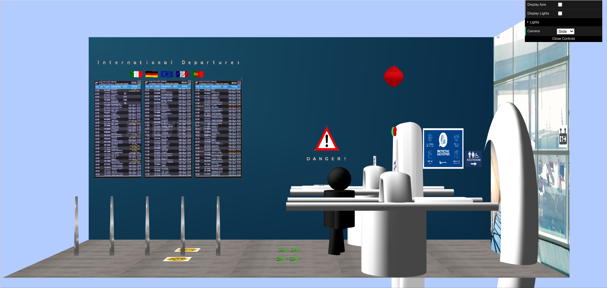
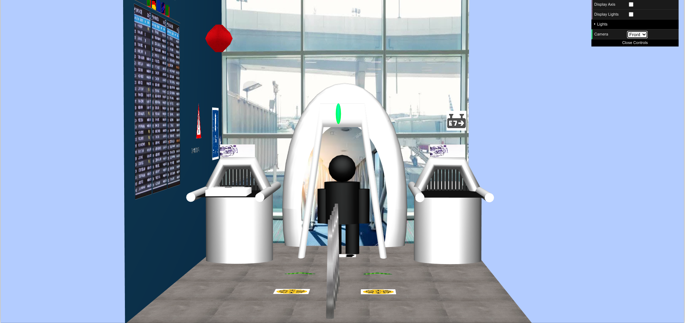

# LAIG 2020/2021 - TP2

## Group: T01G07

| Name             | Number    | E-Mail              |
| ---------------- | --------- | --------------------|
| Rita Peixoto     | 201806257 | up201806257@fe.up.pt|
| Luis Silva       | 201808912 | up201808912@fe.up.pt|

----
## Project information
- Parser with error description that avoids as possible stoping the program
- Parser checks if numbers are floats or ints and gives propper warnings
- Interface with enable/disable display lights and axis
- Choosable Lights turned on and view
- New primitives (plane, patch and defbarrel) and added animation 
- Integration of keyframe animations, sprites and 2D/3D surfaces
- Scene
  - To the scene was added a person that makes the path through the security, placing its belongings in the security mat that pass through the x-ray (sprite animation) and places itself under the security gantry (keyframe animations), facing the gate (defbarrel, plane), having a positive check.  On the floor, it is possible to see some arrows(sprite animation) indicating the direction to follow, and on the wall, there is a flight board (sprite animation) where it's possible to check the state, time, and gate of the flights and also a chinese lamp. The descriptive text (sprite texts) was added in some places and also some flags(patch). 
  
   - [scene](https://git.fe.up.pt/laig/laig-2020-2021/t01/laig-t01-g07/-/blob/master/TP2/scenes/LAIG_TP2_T1G07.xml)
----
## Issues/Problems

- None known bugs

----
## Things to keep in mind
- When does the program execution stops?
  - There isn't a root id defined 
  - It's missing one of the main tags (ex: initials, materials, lights,etc.)
  - There's a non-defined id node
  - There's a node whose id is repeated
  
- Other implementation details
  - Having no descendants is an error, because it doesn't make a lot of sense to have a node without descendants, so something must be wrong
  - Every time something isn't valid, it's ignored and set a default whole element, not only a default component, because, for instance, if the material has an invalid r value for RGB in specular, the output of the parsing won't be what was expected, so to warn the user, we use a default one, something he wasn't expecting to see there
  - Sprite text font is the default and is hardcoded
  - Sprite animations blend with the scene materials having transparencies in the pixels where they're png hasn't got a color defined

[Enunciado](./Enunciado\ T2.pdf)

## Screenshots

